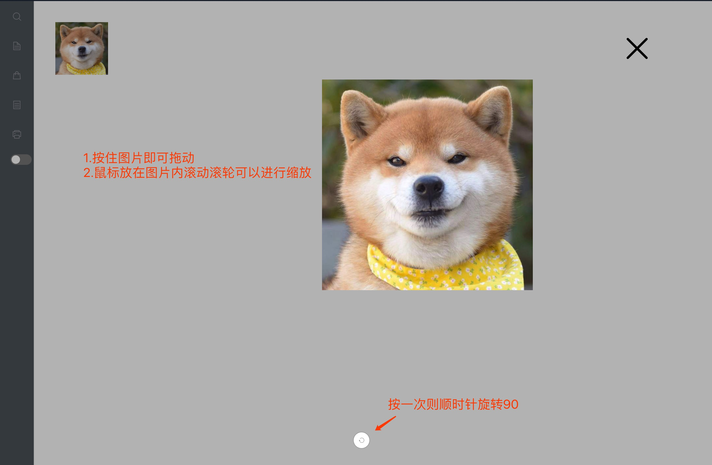

# image-viewer #
## 使用步骤 ##
	1.将插件包下载
	2.将imageViewer文件夹放到工程里
	3.在main中引入  //import imageViewer from 'path/imageViewer'
	4.Vue.use(imageViewer) //注意要在vue实例化执之前引入
	4.在需要点击查看的图片上加 @click="$imageViewer"  //  
    5.在config里进行相应配置
    
## 效果图 ##

